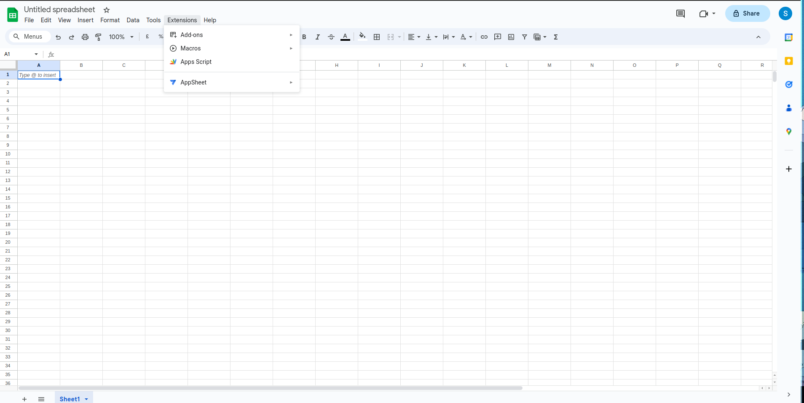
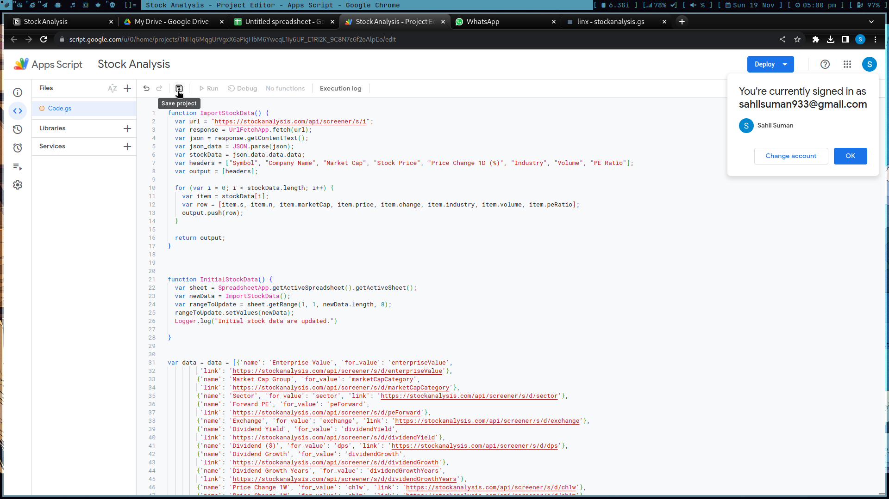
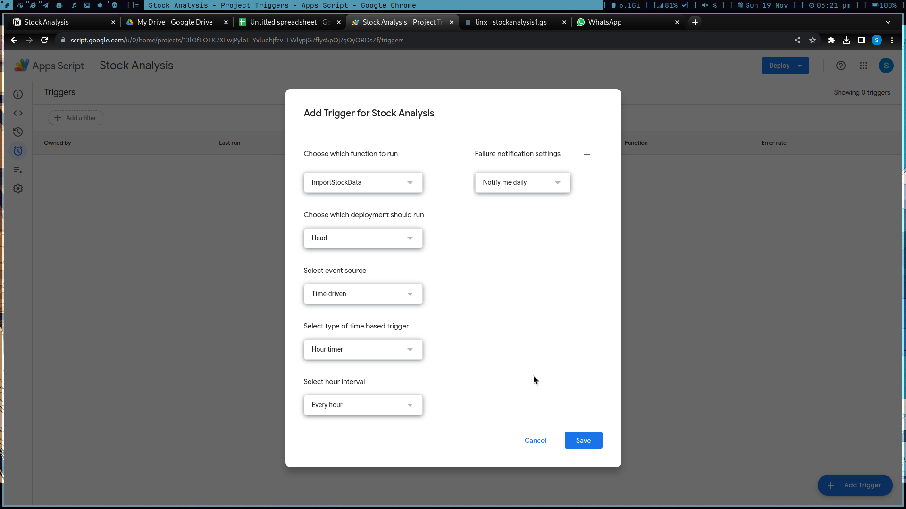
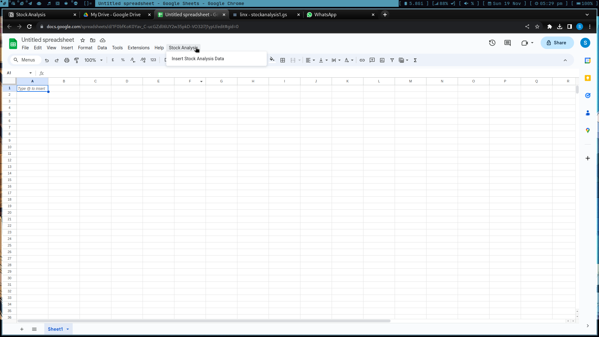
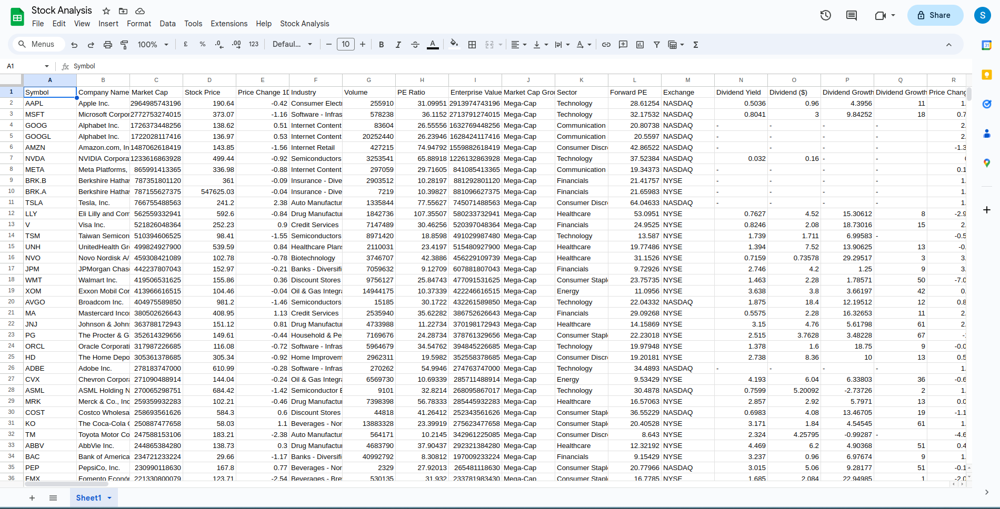

# Stock Analysis

This project scrape 0.8 Million data with all the filters from stock analysis website with the interval of 15 minutes.

**Setup Procedure:**

1. Access the **Extensions** and select **Apps Script**.

   

2. Paste your script and save it.

   

3. Navigate to the **Trigger page**, click **Add Trigger**, and configure the settings as shown below. Authorize
   necessary permissions by clicking "Go to Your script name (unsafe)" and then "Allow."

       
   Note: Adjust the update frequency but consider Google App Script's daily quota limit of 20,000 requests. Avoid
   intervals shorter than 15 minutes without a Google Workspace account.

4. Refresh your Google Sheet. Look for the **Stock Analysis** menu and select **Insert Stock Analysis Data** to populate
   or update the data.

   

**Usage:**

- Data will update automatically based on the trigger setup.
- Manually refresh data by clicking **Insert Stock Analysis Data** under the **Stock Analysis** menu.

## Working Screenshot
